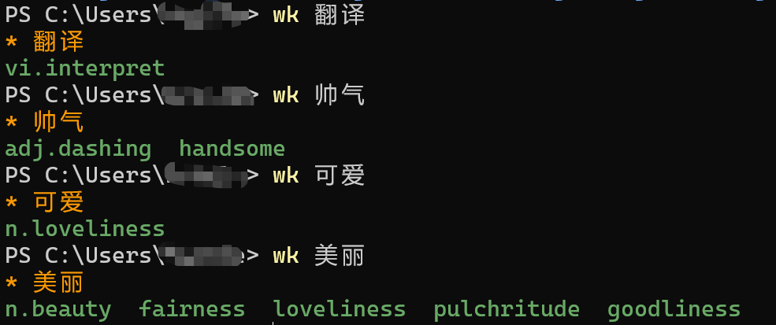

## 当前版本

0.0.6

## 使用方法

1. 将cmd终端添加到任务栏，挪到第一个位置，则可以使用快捷键win + 1 快速打开

   

2. 将wk文件夹的路径添加到Windows的环境变量的Path中，使得全局可使用

   ```shell
   你安装的路径/wk
   ```

3. win + 1 快捷打开cmd，输入wk + [单词] 回车即可显示结果

   

## 支持

- 支持查单词的释义

- 中译英

- 短语翻译


## 开发文档

虚拟环境配置

```shell
# To activate this environment, use                                                
$ conda activate ./envs/wk
             

# To deactivate an active environment, use
$ conda deactivate
```
打包
```shell
Pyinstaller -F ./wk.py     
```
